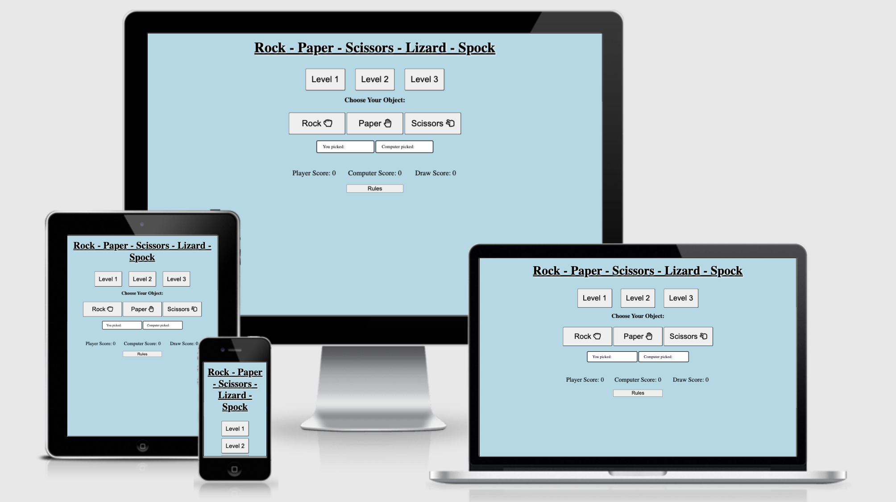

# Rock Paper Scissors Lizard Spock

RPSLS is a web based rock paper scissors game. I created the game in such a way to have a very broard target audience so all ages could understand the concept easliy and play RPS with differeing levels of dificlulty

# Features

## The RPSLS Heading/Title.
- Located at the top of the page the title of the game is easy to find and gives a good breif description of what that game is.

## Level selection section.
- This area allows the user to select the level/difficulty of the game.
- The user will be able to select each of the levels by clicking on the different buttons.
- The user will also be able to easily identify which level is harder and which level is easier by the button label.
- By default the level is set to 1

## Display Section.
- This area shows the user what option they have selected and what option the computer has selected.
- This shows the user why they won or lost the game.

## Option Section.
- This area is where the user selects the weapon/item they would like to use.
- As you increase the levels more item options become available.

## Score Section.
- This area is where the outcome of each game is stored. player win , computer win and draw
- This area is reset when the level/dificulty is changed.

## Features left to implement.
- In the future i would like to add in some sort of animation of the two selections going head to head
- In the future i would like to add s system where you only get a certain amount of tries and who ever has the most points wins overall.

# Testing.

## Heading/Title
- The intended use of the title was to give the user an idea of what the games about, i confimred that it gave the right impression by asking a group of people to describe what the game was about after seeing the title and all of there answers were similar and what i had intended.

## Level Selection.
- The intended use of the level selection area was to let the user decide on what the difficulty of the game was. to make sure this section worked as intended i gave it to a group of people and asked them to test if all the buttons worked and that they corrisponded with the correct levels. Through this method i found that when the level buttons were selected randomly and not in order that the difficulty wouldnt match the selected level. to fix this problem i simplified the code and took out unneeded logic.

## Display.
- The intended use of this section was to allow the user to see how / why they have won,lost or drew. i confirmed that it displays the correct details through running the game multiple times randomly choosing the items and looking at what is displayed on screen and what is also printed in the console to make sure they matched and is was diplaying correctly.

## Option Selection.
- The intended use of this section was to allow the user the option to pick which weapon/item they wanted and to increase the amount of options available when the leverl is increased. i made sure this worked by using the same group of people as before and getting them to play the game until the found a bug, they reported that the buttons worked consistantly.

## Score Section.
-The intened use of this section was to display the score of who won and how many draws there were. to test that it worked i used the same method as the option selector, the group found a bug which was when the game is first loaded the score wasnt going up you had to select a level before being able to play, to fic this bug i hard coded it so when the game is first loaded is automatically selects level 1 by default.

# Validator Testing.

## HTML

## CSS
First is for default styling and second is for media queries

## JS

The Unused variables arnt used within the JS but are used within the HTML

## Deployment

This section should describe the process you went through to deploy the project to a hosting platform (e.g. GitHub) 

- The site was deployed to GitHub pages. The steps to deploy are as follows: 
  - In the GitHub repository, navigate to the Settings tab 
  - From the source section drop-down menu, select the Master Branch
  - Once the master branch has been selected, the page will be automatically refreshed with a detailed ribbon display to indicate the successful deployment.

  The live link can be found here - https://alrxdaley.github.io/RPS/

## Credits/Content
  Credit to Code Institue for the Development wording
  The icons in the footer were taken from [Font Awesome](https://fontawesome.com/)

