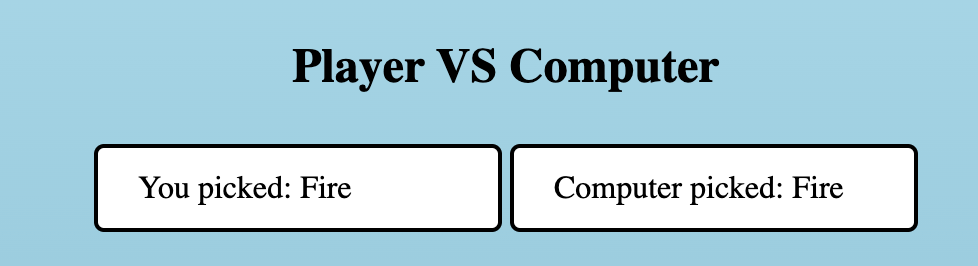

# Rock Paper Scissors

RPS is a web based rock paper scissors game. I created the game in such a way to have a very broard target audience so all ages could understand the concept easliy and play RPS with differeing levels of dificlulty

## Purpose

The purpose of this website was to allow people to play rock paper scissors agaisnt a computer with increasing difficulty depending on the level selected.
the value to the user is that is it simple and intuitive and allows all ages play rock paper scissors against the computer.

### Possible Scenarios for user value

- You could be an only child and want to play rock paper scissors but all of your friends are busy, but with this rock paper scissors website you're
able to play for however long you want and when you want.

- You could be a teenager that loved to play rock paper scissors with your friends but wanted more of a challenge, with this rock paper scissors website you're able to play at different difficulties depending on whish level you select.

- You could love to play rps but all your friends cheat and dont play properly, whit this rock paper scissors website the computer you play agaisnt is incapable of cheating and every level is balanced and is all relient on chance.

I think that my website has value for the user due to it being simple but also intuitive and easy to follow / pla

# Features

## The RPSLS Heading/Title.
- Located at the top of the page the title of the game is easy to find and gives an idea of what the web page is about.

## Level selection section.
- This area allows the user to select the level/difficulty of the game.
- The user will be able to select each of the levels by clicking on the different buttons.
- The user will also be able to easily identify which level is harder and which level is easier by the button label.
- By default the level is set to 1

## Display Section.
- This area shows the user what option they have selected and what option the computer has selected.
- This shows the user why they won or lost the game.

## Option Section.
- This area is where the user selects the weapon/item they would like to use.
- As you increase the levels more item options become available.

## Score Section.
- This area is where the outcome of each game is stored. player win , computer win and draw
- This area is reset when the level/dificulty is changed.

## Rules Section
- This buttons pulls up the rules for the game using an alert.

## Features left to implement.
- In the future i would like to add in some sort of animation of the two selections going head to head
- In the future i would like to add s system where you only get a certain amount of tries and who ever has the most points wins overall.

# WireFrames.

With regards to the differences between the initial wire frames and the overall look of the website, i changed and added details that 
i thought would be benifical to the flow of information and the overall UX design of the website.

# Testing.

## Steps i took for testing

Functional Testing
  - Identifying if the program does what its meant to do
  - Testing all the inputs are working and out putting the right data

Usibility Test
  - I hired a group of people to use the website and give feedback on what they thought could be improved and
    if they thought it met the criteria i set out to acheive.
  - I then took the results and fixed / changed what was wrong and then repeated this proccess.

Responsivity testing
  - This stage was sort of the same / mixed with the pervious stage as it was having people test the web page on different devices and report what they found out.

## Testing guidlines
- Make sure webpage is compatiable with smarthpone devices
- Ensure the site is simple and easy to navigate
- Ensure buttons are large enough to be seen and clicked on
- Optimize image sizes and object sizes with regards to responsivity

## Heading/Title
- The intended use of the title was to give the user an idea of what the games about, i confimred that it gave the right impression by asking a group of people to describe what the game was about after seeing the title and all of there answers were similar and what i had intended.

## Level Selection.
- The intended use of the level selection area was to let the user decide on what the difficulty of the game was. to make sure this section worked as intended i gave it to a group of people and asked them to test if all the buttons worked and that they corrisponded with the correct levels. Through this method i found that when the level buttons were selected randomly and not in order that the difficulty wouldnt match the selected level. to fix this problem i simplified the code and took out unneeded logic.

## Display.
- The intended use of this section was to allow the user to see how / why they have won,lost or drew. i confirmed that it displays the correct details through running the game multiple times randomly choosing the items and looking at what is displayed on screen and what is also printed in the console to make sure they matched and is was diplaying correctly.

## Option Selection.
- The intended use of this section was to allow the user the option to pick which weapon/item they wanted and to increase the amount of options available when the leverl is increased. i made sure this worked by using the same group of people as before and getting them to play the game until the found a bug, they reported that the buttons worked consistantly.

## Score Section.
- The intened use of this section was to display the score of who won and how many draws there were. to test that it worked i used the same method as the option selector, the group found a bug which was when the game is first loaded the score wasnt going up you had to select a level before being able to play, to fic this bug i hard coded it so when the game is first loaded is automatically selects level 1 by default.

## Responsivity
- when dealing with responsivity the first time i took the aproach of having lots if different media queries for each screen size, after testing and consulting with the test group i found this way to be long and not effective at all. so to fix the problem i went back throuhg my code and changed the structure of my css and html to better suit responsivity. after a few trial and errors i was able to get the reponsivity working so i went back the the test group and consulted with them and let them test it, they reported it was a major improvement to the first attempt and works as it should.

# Bugs
- a bug/oversight i found was that my website was not fully responsive with the media queries i had put in place.
  - to fix this bug/mistake i went back over some course material about css and used the auto features on the margin and padding which aloud me to make the website fully responive.

- when playing with the added button in level three the computer was still able to select lizard and spock even though they wern't options in that level
  - to fix this bug i added a dictionary with all the game options numbered 1 - 9. i then created another dictionary holding the three levels of difficulty which each had a list as the value. when each level is selected it takes the key for its spesific list and lets the player and computer select a game option that is within its list.

# Validator Testing.

## HTML

## CSS

## JS

The Unused variables arnt used within the JS but are used within the HTML

## Deployment

- The site was deployed to GitHub pages. The steps to deploy are as follows: 
  - In the GitHub repository, navigate to the Settings tab 
  - From the source section drop-down menu, select the Master Branch
  - Once the master branch has been selected, the page will be automatically refreshed with a detailed ribbon display to indicate the successful deployment.

  The live link can be found here - https://alrxdaley.github.io/RPS/

## Credits/Content
  Credit to Code Institue for the Development wording

  The icons in the footer were taken from [Font Awesome](https://fontawesome.com/)

